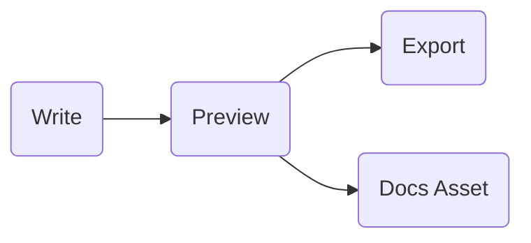

# hello-world
This is a test for a first repository

I'm going to try and create a mermaid chart in the readme to see if that is a thing.

```mermaid
flowchart LR
  A(Write) --> B(Preview)
  B --> C(Export)
  B --> D(Docs Asset)
```

  That should make a flow chart in the readme.
